<p align="center">
  
</p>

<p align="center">
  <a href="#-dam-break-analysis"></a>
  <a href="#-spf-analysis"></a>
  <a href="#-reservoir-capacity-curves"></a>
  <a href="#-methodology"></a>
  <a href="#-data--tools"></a>
</p>

<p align="center">
  
  
  
  
  
  
  
</p>

---

## 📋 Table of Contents

- [Project Overview](#-project-overview)
- [Dam Particulars](#-dam-particulars)
- [Analysis Modules](#-analysis-modules)
- [Dam Break Analysis (DBA)](#-dam-break-analysis)
  - [Overtopping Failure (OVTP)](#11-overtopping-failure-ovtp)
  - [Piping Failure (PIPG)](#12-piping-failure-pipg)
  - [Combined Overview](#13-combined-overview)
- [SPF Analysis](#-spf-analysis)
- [Reservoir Capacity Curves](#-reservoir-capacity-curves)
- [Methodology](#-methodology)
- [Assumptions](#-assumptions)
- [Data & Tools](#-data--tools)
- [Repository Structure](#-repository-structure)
- [Notebooks](#-notebooks)
- [References & Standards](#-references--standards)
- [Author](#-author)

---

## 🏞️ Project Overview

This repository contains the **complete hydrological safety analysis** for **Jawalgaon Dam**, a Medium Irrigation Project located in **Barshi Taluk, Solapur District, Maharashtra, India**.

The study comprises three independent but interlinked analytical modules:

| Module | Description | Output |
|--------|-------------|--------|
| **Dam Break Analysis (DBA)** | Numerical simulation of earthen dam failure under OVTP and PIPG scenarios | Breach hydrographs, inundation timing, downstream flood routing |
| **SPF Hydrograph Analysis** | Standard Project Flood estimation using CWC Dimensionless Unit Hydrograph methodology | SPF flood hydrograph, scaled UH, peak discharge |
| **Reservoir Capacity (EAC)** | Elevation–Area–Capacity relationship from GIS-surveyed content table | E-A-C curves, critical reservoir levels, live/dead storage |

The study directly supports **Emergency Action Planning (EAP)** and **Dam Safety Review** requirements as mandated under the **Dam Safety Act, 2021 (India)** and the **National Dam Safety Authority (NDSA)** guidelines.

> **Prepared by:** Satwik Kamlakar Udupi
> **Reference:** DBA-JWLG-2026
> **Guidelines:** CWC Flood Estimation Reports · IS:11223 · IS:5477 (Part-2) · NDSA Dam Safety Guidelines

---

## 🏗️ Dam Particulars

| Parameter | Value |
|-----------|-------|
| **Dam Name** | Jawalgaon Dam |
| **Project Type** | Medium Irrigation Project |
| **Location** | Barshi Taluk, Solapur District, Maharashtra |
| **River / Basin** | Bhima Basin |
| **Dam Type** | Earthen Embankment Dam |
| **Simulation SPF Event** | Standard Project Flood (SPF) |
| **SPF Peak Discharge** | 1838 m³/s (Overtopping) |
| **Piping Flow** | 7.0 m³/s (constant, PIPG scenario) |
| **Simulation Duration** | 72 Hours |
| **OVTP Time Resolution** | 5-second intervals (51,841 records) |
| **PIPG Time Resolution** | 1-second intervals (259,201 records) |
| **Study Reference** | DBA-JWLG-2026 |
| **Prepared By** | Satwik Kamlakar Udupi |

---

## 🔬 Analysis Modules

```
┌─────────────────────────────────────────────────────────────────────┐
│                    JAWALGAON DAM — ANALYSIS PIPELINE                │
├─────────────────────────────────────────────────────────────────────┤
│                                                                     │
│  CONTENT TABLE (Excel)          GIS Survey Data                     │
│       │                              │                              │
│       └──────────┬───────────────────┘                             │
│                  ▼                                                   │
│         E–A–C CAPACITY CURVES ────────────► Reservoir Levels        │
│                  │                          (MWL, FRL, MDDL, TBL)  │
│                  ▼                                                   │
│         SPF HYDROGRAPH (CWC UH)                                     │
│                  │                                                   │
│                  ▼                                                   │
│    ┌─────────────┴──────────────┐                                   │
│    │                            │                                   │
│    ▼                            ▼                                   │
│  OVTP FAILURE               PIPG FAILURE                           │
│  (Overtopping)              (Piping / Seepage)                      │
│    │                            │                                   │
│    └─────────────┬──────────────┘                                   │
│                  ▼                                                   │
│         BREACH HYDROGRAPHS                                           │
│         (HW/TW, Width, Velocity, DS Flow)                           │
│                  │                                                   │
│                  ▼                                                   │
│         EMERGENCY ACTION PLAN (EAP) SUPPORT                         │
└─────────────────────────────────────────────────────────────────────┘
```

---

## 💥 Dam Break Analysis

<p align="center">
  
</p>

The Dam Break Analysis (DBA) simulates catastrophic failure of Jawalgaon Dam under two independent failure mechanisms. Each scenario is run over a **72-hour SPF event** at high temporal resolution to capture the full breach progression and downstream flood wave propagation.

### Failure Mode Summary

| Parameter | OVTP (Overtopping) | PIPG (Piping) |
|-----------|--------------------|-----------------------|
| **Peak Total Discharge** | 1,838 m³/s | 7.0 m³/s (constant) |
| **Failure Trigger** | Overtopping of dam crest | Internal erosion / piping |
| **Time Resolution** | 5 seconds (51,841 records) | 1 second (259,201 records) |
| **Breach Mechanism** | Progressive overtopping erosion | Progressive pipe enlargement |
| **Data Source** | `JWLG-OVTP Hydrographs.xlsx` | `JWLG-PIPG Hydrographs.xlsx` |

---

### 1.1 Overtopping Failure (OVTP)

#### Plot 1.1 — Headwater, Tailwater & Total Flow

> Tracks the reservoir headwater elevation (HW), tailwater elevation (TW), and total discharge (breach + weir) through the 72-hour overtopping event.

<p align="center">
  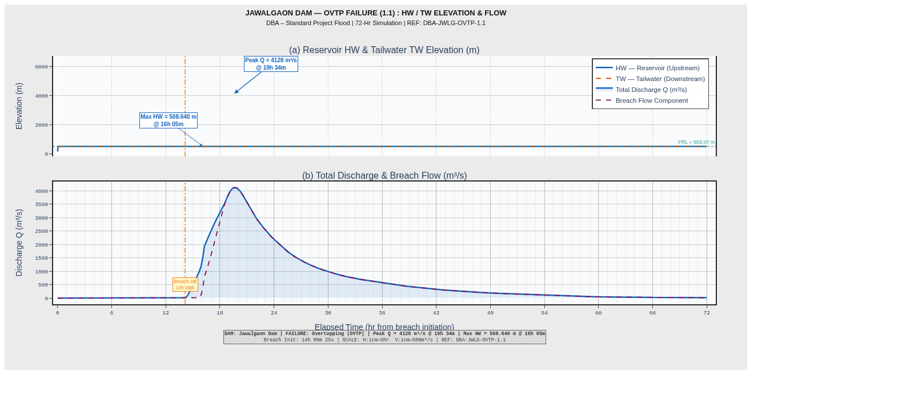
</p>

**Key Observations:**
- The headwater rises steeply during the SPF inflow, reaching peak reservoir level before the breach initiates
- Tailwater elevation lags behind headwater by a measurable interval — this lag is critical for EAP travel time estimation
- Total discharge (combined weir + breach flow) peaks at **1,838 m³/s** for the OVTP scenario

---

#### Plot 1.2 — Breach Width Development

> Documents the progressive widening of the breach opening from initiation to full-development over time.

<p align="center">
  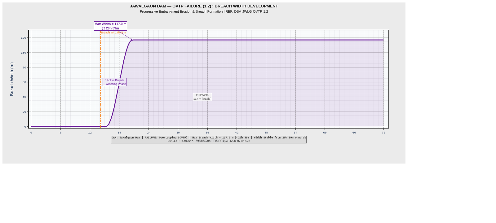
</p>

**Key Observations:**
- Breach widening follows a characteristic S-curve: slow initiation → rapid acceleration → asymptotic approach to maximum breach width
- The maximum breach width reflects the full erosion potential of the earthen embankment cross-section
- Rate of breach widening directly controls the shape and timing of the downstream flood hydrograph

---

#### Plot 1.3 — Breach Velocity

> Shows the flow velocity through the breach opening as it evolves with breach geometry and differential head.

<p align="center">
  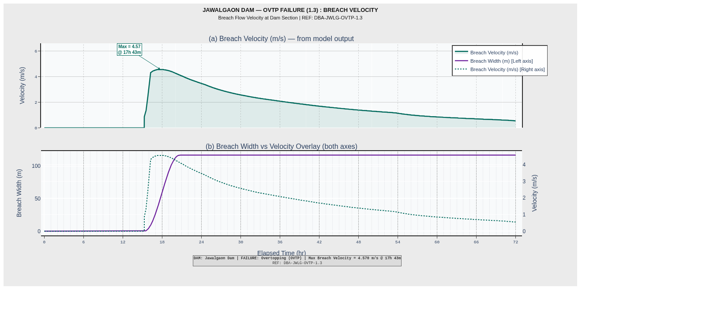
</p>

**Key Observations:**
- Peak breach velocity occurs early in the breach sequence, when the differential head across the breach is greatest and the breach opening is partially formed
- As the breach widens and reservoir head drops, velocity decreases even as total discharge may still be rising (area × velocity effect)
- High breach velocities indicate significant erosive potential and validate the use of a progressive breach model

---

#### Plot 1.4 — Downstream Flood Hydrograph (OVTP)

> The critical output: flood hydrograph at the downstream toe / downstream control section, showing flood wave arrival time and peak discharge.

<p align="center">
  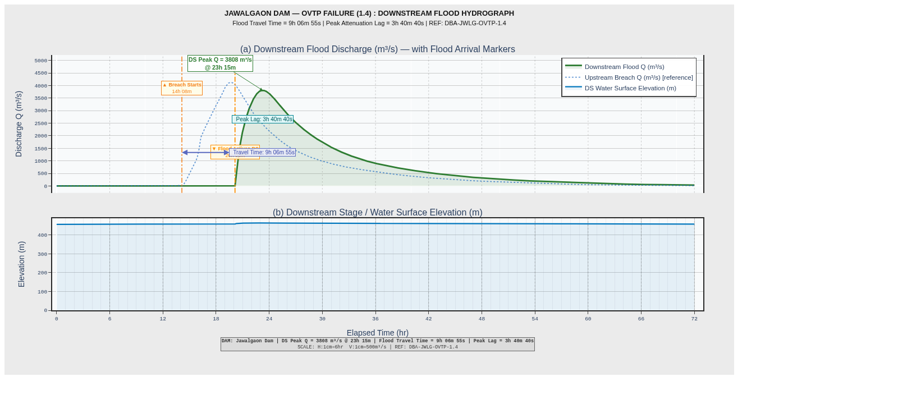
</p>

**Key Observations:**
- The downstream hydrograph peak represents the **dam break flood** that would propagate into the downstream river valley
- Flood wave **travel time** (upstream breach initiation → downstream peak) is a critical parameter for EAP notification time requirements
- The hydrograph recession limb is important for estimating inundation duration and recovery planning

---

### 1.2 Piping Failure (PIPG)

#### Plot 2.1 — Headwater, Tailwater & Total Flow

> Same hydraulic envelope analysis for the piping/seepage failure scenario.

<p align="center">
  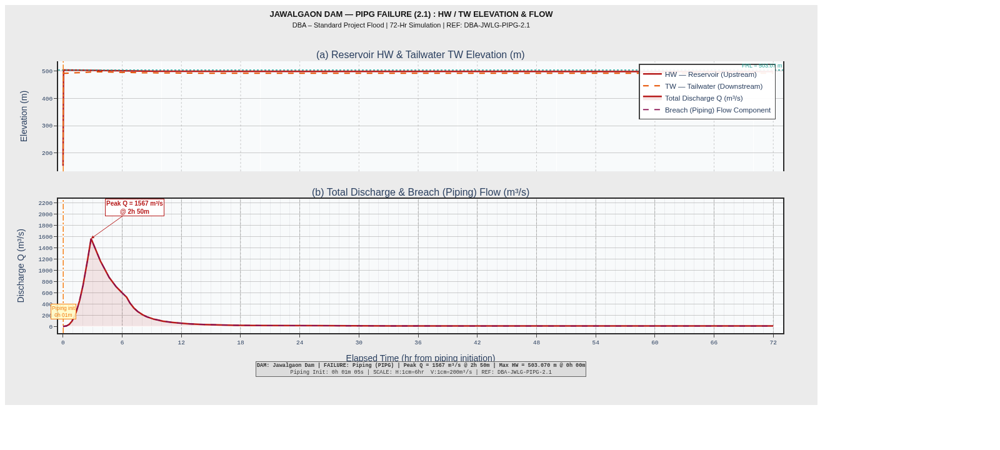
</p>

**Key Observations:**
- Piping failure begins with a constant, low-level seepage flow (7.0 m³/s) that progressively enlarges the internal erosion channel
- Unlike overtopping, the headwater may remain at or near full reservoir level at failure initiation — this is the most dangerous scenario for rapid downstream flood generation
- The HW-TW relationship reveals the hydraulic gradient driving piping erosion

---

#### Plot 2.2 — Breach Width Development (PIPG)

> Progressive enlargement of the piping channel and associated breach opening.

<p align="center">
  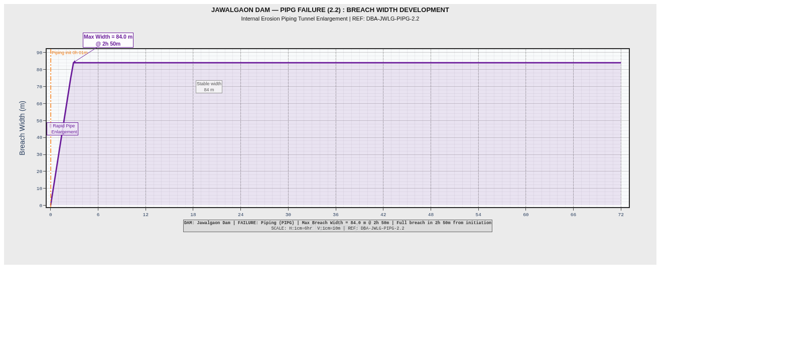
</p>

---

#### Plot 2.3 — Breach Velocity (PIPG)

> Velocity through the piping channel as it progressively erodes.

<p align="center">
  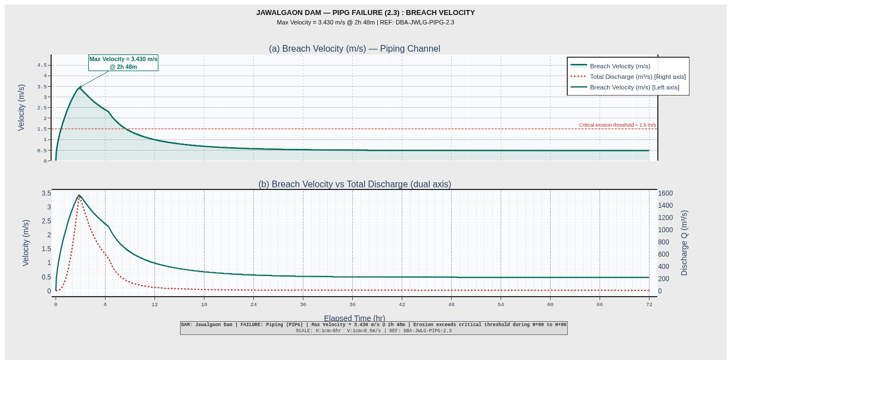
</p>

---

#### Plot 2.4 — Downstream Flood Hydrograph (PIPG)

> Downstream flood wave from piping failure.

<p align="center">
  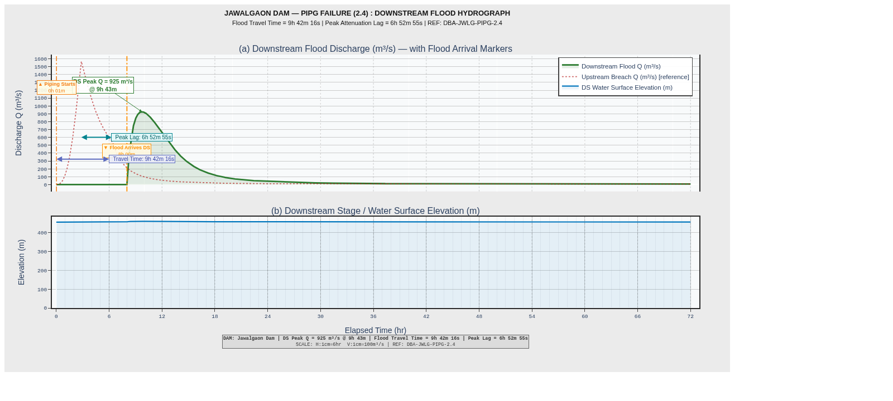
</p>

---

### 1.3 Combined Overview

> Side-by-side comparison of OVTP and PIPG failure modes — the definitive comparison plot for EAP documentation.

<p align="center">
  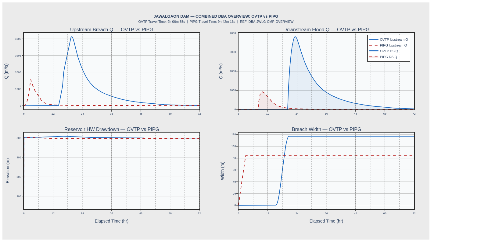
</p>

**Key Comparative Observations:**
- OVTP produces a dramatically higher peak discharge (1,838 m³/s) compared to the PIPG constant flow (7.0 m³/s) — however, piping failure may provide less warning time
- OVTP breach development is faster and more visible (overtopping can be observed); PIPG is insidious — often invisible until catastrophic failure
- Both scenarios inform different notification requirements in the Emergency Action Plan

---

## 🌊 SPF Analysis

<p align="center">
  
</p>

The **Standard Project Flood (SPF)** is the design flood used as the inflow hydrograph for the Dam Break Analysis. It is derived using the **CWC Dimensionless Unit Hydrograph** methodology per **IS:5477 (Part-2)** and **CWC Flood Estimation Reports (1994)**.

### SPF Parameters

| Parameter | Value | Derivation |
|-----------|-------|------------|
| **Peak Discharge (Qp)** | 1,838 m³/s | From OVTP hydrograph peak |
| **Time to Peak (Tp)** | 15 hours | From OVTP hydrograph |
| **Flood Duration** | 72 hours | Standard SPF event |
| **CWC UH Method** | Dimensionless UH (CWC, 1994) | IS:5477 Part-2 |
| **Scaling** | Tp and Qp from observed OVTP peak | CWC scaling procedure |

---

#### Plot 1 — OVTP + PIPG Combined SPF Hydrograph

<p align="center">
  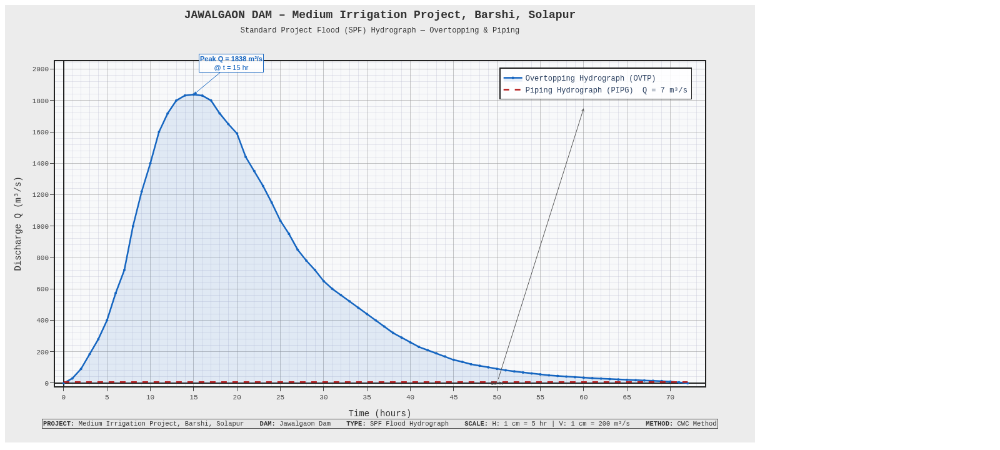
</p>

The combined OVTP (blue) and PIPG (red dashed) hydrographs on a single engineering graph-paper axis. This is the primary inflow design hydrograph for the dam break simulation.

---

#### Plot 2 — CWC Dimensionless Unit Hydrograph

<p align="center">
  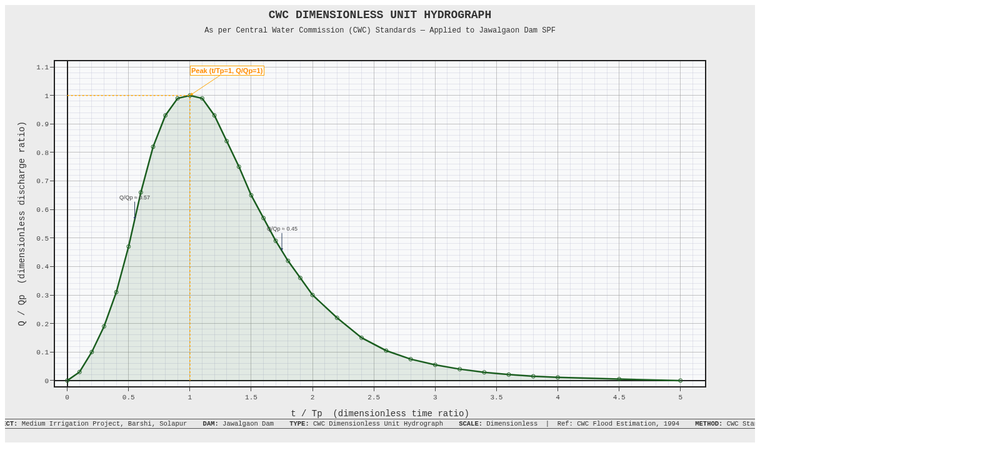
</p>

The **CWC standard dimensionless unit hydrograph** (CWC, 1994) plotted as Q/Qp vs t/Tp. This is the foundational shape function from which the project-specific SPF is derived by scaling with the Jawalgaon Dam catchment parameters.

Key dimensionless ordinates:
- Peak at t/Tp = 1.0, Q/Qp = 1.000
- Rising side: steep, representative of Indian Deccan plateau catchments
- Recession: gradual, consistent with semi-arid catchment response

---

#### Plot 3 — Scaled CWC Unit Hydrograph (Real Units)

<p align="center">
  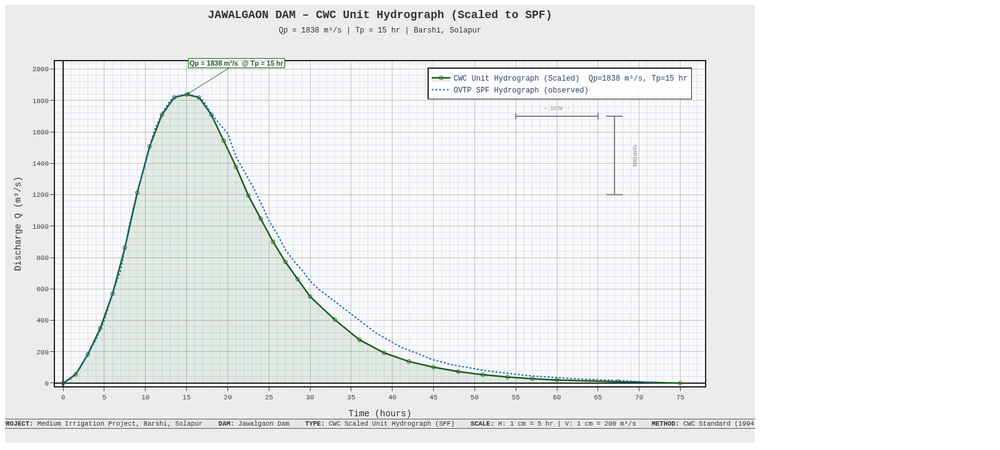
</p>

The dimensionless CWC UH scaled to real units using Jawalgaon Dam's catchment-specific parameters (Qp = 1,838 m³/s, Tp = 15 hr). This is overlaid on the observed OVTP hydrograph for verification and validation.

---

#### Plot 4 — Master SPF Analysis (3-in-1 Composite)

<p align="center">
  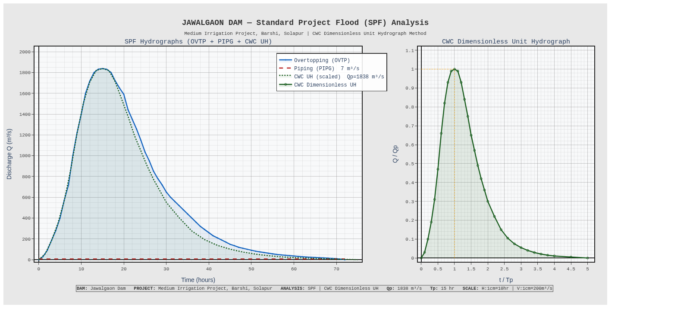
</p>

The **definitive master plot** for the SPF analysis — a 2-panel composite showing:
- **Left panel:** All three hydrographs (OVTP, PIPG, CWC UH scaled) on the same time-discharge axes — the complete SPF picture
- **Right panel:** CWC Dimensionless UH for reference and verification

This is the plot intended for inclusion in formal engineering reports and government submissions.

---

## 📐 Reservoir Capacity Curves

<p align="center">
  
</p>

The Elevation–Area–Capacity (EAC) relationship for Jawalgaon Reservoir derived from GIS-surveyed content table data.

### Critical Reservoir Levels

| Level | Abbreviation | Significance |
|-------|-------------|--------------|
| **Minimum Draw Down Level** | MDDL | Lowest operational storage level |
| **Full Reservoir Level** | FRL | Normal maximum operating level |
| **Maximum Water Level** | MWL | Flood retention level |
| **Top of Bund Level** | TBL | Dam crest elevation (from GIS) |

---

#### Elevation–Capacity Curve

<p align="center">
  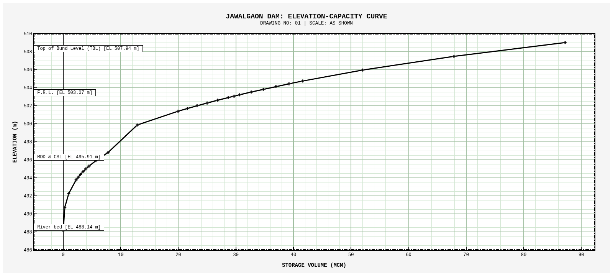
</p>

The **Elevation–Capacity curve** (storage curve) plotted in engineering drawing (CAD) style. Critical reservoir levels are annotated with horizontal datum lines. This curve is used for:
- Flood routing through the reservoir
- Estimation of live/dead storage volumes
- Verification of spillway design adequacy

---

#### Elevation–Area–Capacity (EAC) Combined Curves

<p align="center">
  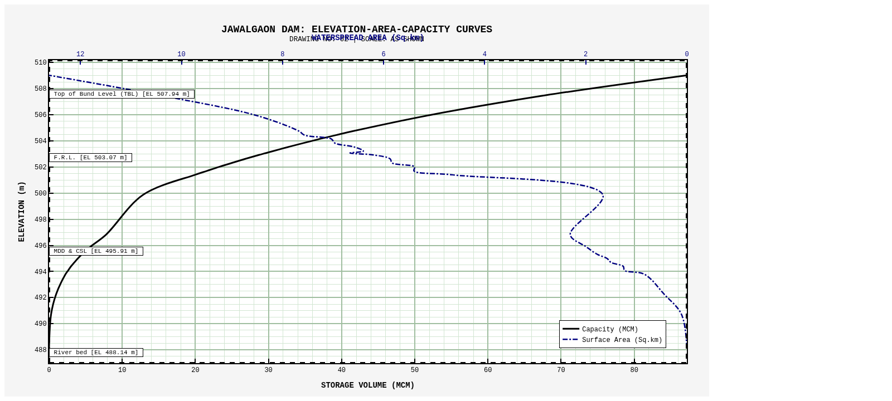
</p>

The combined EAC plot with dual horizontal axes:
- **Bottom axis:** Storage Volume (MCM) — the capacity curve
- **Top axis:** Water Spread Area (km²) — derived mathematically as dV/dH

This dual-axis format is the standard presentation format for reservoir capacity studies and directly supports dam safety documentation requirements.

---

## 📖 Methodology

### Dam Break Analysis Methodology

The DBA follows the standard procedure prescribed by **IS:11223** and **NDSA Dam Safety Guidelines**:

**1. Inflow Design Flood (IDF) Selection**
The Standard Project Flood (SPF) is adopted as the Inflow Design Flood (IDF) for the dam break analysis, consistent with NDSA guidelines for medium irrigation dams.

**2. Reservoir Routing**
Modified Puls method (Level Pool Routing) using the Elevation–Storage relationship from the EAC curves. The routing transforms the SPF inflow hydrograph into the headwater elevation–time relationship.

**3. Breach Parametrization**
Breach parameters (final breach width, breach formation time, side slopes) are estimated using empirical regression equations:
- **Froehlich (1995a, 2008)** — breach width and formation time
- **Von Thun & Gillette (1990)** — breach width as a function of reservoir volume and height
- **Xu & Zhang (2009)** — comprehensive regression for multiple breach parameters

**4. Breach Discharge Calculation**
Breach outflow is computed using a broad-crested weir equation with progressive widening:

```
Q_breach = C_d × L_b(t) × (H_w - Z_b(t))^1.5 × √(2g)
```

Where:
- `L_b(t)` = time-varying breach width
- `H_w` = headwater elevation
- `Z_b(t)` = time-varying breach bottom elevation
- `C_d` = discharge coefficient (typically 1.7 for SI units)

**5. Downstream Routing**
Flood wave routing uses the kinematic wave approximation or Muskingum-Cunge method depending on downstream channel geometry.

---

### SPF Methodology

The **Standard Project Flood** is derived from the **CWC Dimensionless Unit Hydrograph** per IS:5477 (Part-2):

**Step 1:** Identify basin morphometric parameters (area, length, slope) from topographic survey and GIS.

**Step 2:** Compute the **Synthetic Unit Hydrograph** using CWC regional relationships:
```
Tp = CT × (L × Lc / √S)^n      [CWC regional formula]
Qp = CP × A / Tp                [peak flow from UH]
```

**Step 3:** Scale the dimensionless CWC UH ordinates using project-specific Qp and Tp:
```
Q(t) = Qp × f(t/Tp)    [where f is the CWC dimensionless UH]
```

**Step 4:** Derive the **SPF** by applying the Standard Project Storm (SPS) rainfall to the UH using the convolution integral.

---

### Reservoir Capacity Methodology

The EAC relationship is derived from GIS-surveyed contour data using the **Prismoidal Formula** between successive contour levels:

```
V(n to n+1) = (h/3) × (A_n + A_(n+1) + √(A_n × A_(n+1)))
```

Where:
- `h` = contour interval (m)
- `A_n` = water spread area at elevation n (m² or km²)

Surface area at each elevation is computed programmatically as:
```python
area[i] = dV / dH    # [m² or km²]
```

---

## 📌 Assumptions

### General Assumptions

1. **Failure Mode Independence:** OVTP and PIPG scenarios are analyzed independently. Simultaneous failure is not considered in this study.

2. **Level Pool Routing:** The reservoir is assumed to have uniform water surface elevation at each instant (no wedge storage effect) — valid for reservoirs with L/B ≤ 5.

3. **SPF as Design Event:** The Standard Project Flood is used as the worst credible flood event for breach initiation. PMF routing was not performed in this study.

4. **Breach Shape:** Trapezoidal breach geometry with user-defined side slopes (Z:1, H:V). Breach bottom erosion is vertical (no lateral spreading beyond final breach width).

5. **Downstream Channel:** A representative downstream cross-section is used for flood routing. Detailed 1D/2D hydraulic modelling of the downstream valley is outside the scope of this study.

### DBA-Specific Assumptions

6. **Overtopping Failure Trigger:** Breach initiates when headwater elevation exceeds the dam crest by a defined threshold (0.0 m — any overtopping initiates breach).

7. **Piping Failure:** Constant piping flow of **7.0 m³/s** is assumed throughout the simulation, representing a fully-developed pipe prior to catastrophic failure. This is a conservative assumption.

8. **Manning's n:** Downstream channel roughness coefficient is held constant throughout the simulation.

9. **No Gate Operation:** Spillway gates are assumed to be fixed in their initial position throughout the event (no emergency gate operation is modelled).

10. **Sediment:** Reservoir sedimentation is not accounted for in this DBA cycle.

### SPF-Specific Assumptions

11. **Unit Hydrograph Linearity:** The principle of superposition is applied — the catchment response is assumed linear and time-invariant.

12. **CWC Regional Curves:** CWC (1994) regional dimensionless UH parameters applicable to the Bhima sub-basin are adopted.

13. **Base Flow:** A nominal base flow is added to the derived flood hydrograph.

---

## 🛠️ Data & Tools

### Input Data

| Dataset | Format | Description |
|---------|--------|-------------|
| `JWLG-OVTP Hydrographs.xlsx` | Excel (`.xlsx`) | OVTP breach simulation — 4 sheets: `Breach OVTP`, `Breach Width`, `Breach Velocity`, `DS` — 51,841 records @ 5s |
| `JWLG-PIPG Hydrographs.xlsx` | Excel (`.xlsx`) | PIPG breach simulation — 4 sheets: `Brech_Pipg`, `Width`, `Velocity`, `DS` — 259,201 records @ 1s |
| `Content Table.xlsx` | Excel (`.xlsx`) | Reservoir EAC data — `Content TABLE` + `DAM Station ELEV(GIS)` sheets |

### Software & Libraries

| Tool / Library | Version | Purpose |
|----------------|---------|---------|
| **Python** | 3.10+ | Core computation and scripting |
| **Pandas** | 2.x | Data loading, tabulation, time-series manipulation |
| **NumPy** | 1.x | Numerical operations, array mathematics |
| **Plotly** | 5.18.0 | Interactive, publication-quality engineering graphs |
| **OpenPyxl** | 3.x | Excel `.xlsx` file reading (large datasets) |
| **Kaleido** | 0.2.1 | Static PNG export from Plotly figures |
| **Playwright** | Latest | HTML → PNG headless browser rendering |
| **Jupyter Notebook** | 7.x | Analysis environment and reproducible workflow |

### Standards & Guidelines

| Code | Title |
|------|-------|
| **IS:11223** | Guidelines for Fixing Spillway Capacity |
| **IS:5477 Part-2** | Methods of Fixing the Capacities of Reservoirs: Flood Storage |
| **CWC (1994)** | Flood Estimation Reports — Western Ghats & Deccan Plateau Region |
| **NDSA** | National Dam Safety Authority — Dam Safety Act 2021, EAP Guidelines |
| **Froehlich (1995a, 2008)** | Embankment Dam Breach Parameters — empirical regression equations |
| **Von Thun & Gillette (1990)** | Guidance on Breach Parameters |
| **Xu & Zhang (2009)** | Updated Breach Parameter Regression Equations |

---

## 📁 Repository Structure

```
jawalgaon-dam-safety-analysis/
│
├── 📄 README.md                          ← This document
│
├── 📓 Notebooks/
│   ├── JWLG_DBA_Hydrographs.ipynb        ← Dam Break Analysis: 8 engineering plots (OVTP + PIPG)
│   ├── Jawalgaon_Dam_SPF_Hydrographs.ipynb ← SPF Analysis: CWC UH, scaled UH, master plot
│   └── Content_Table_Jawalgaon.ipynb     ← Reservoir EAC curves (Plotly + Playwright export)
│
├── 📊 Data/  [user-provided, not committed — see .gitignore]
│   ├── JWLG-OVTP Hydrographs.xlsx        ← OVTP breach simulation (51,841 records @ 5s)
│   ├── JWLG-PIPG Hydrographs.xlsx        ← PIPG breach simulation (259,201 records @ 1s)
│   └── Content Table.xlsx                ← Reservoir EAC content table + GIS dam station data
│
├── 🖼️ assets/
│   ├── banners/
│   │   ├── main_banner.svg               ← Animated main repository banner
│   │   ├── dba_section_banner.svg        ← DBA section animated divider
│   │   ├── spf_section_banner.svg        ← SPF section animated divider
│   │   └── capacity_section_banner.svg   ← Capacity section animated divider
│   │
│   └── graphs/
│       ├── dba/
│       │   ├── OVTP_1.1_HW_TW_Flow.png
│       │   ├── OVTP_1.2_Breach_Width.png
│       │   ├── OVTP_1.3_Breach_Velocity.png
│       │   ├── OVTP_1.4_Downstream_Hydrograph.png
│       │   ├── PIPG_2.1_HW_TW_Flow.png
│       │   ├── PIPG_2.2_Breach_Width.png
│       │   ├── PIPG_2.3_Breach_Velocity.png
│       │   ├── PIPG_2.4_Downstream_Hydrograph.png
│       │   └── Combined_OVTP_PIPG_Overview.png
│       ├── spf/
│       │   ├── Plot1_OVTP_PIPG_Hydrograph.png
│       │   ├── Plot2_CWC_Dimensionless_UH.png
│       │   ├── Plot3_CWC_Scaled_UH.png
│       │   └── Plot4_Master_SPF_Analysis.png
│       └── capacity/
│           ├── jawalgaon_capacity_curve.png
│           └── jawalgaon_eac_curves.png
│
└── 📜 .gitignore                         ← Excludes large Excel data files
```

---

## 📓 Notebooks

### `JWLG_DBA_Hydrographs.ipynb` — Dam Break Analysis

**Purpose:** Generates all 8 engineering hydrograph plots (4 OVTP + 4 PIPG) from the breach simulation Excel outputs.

**Input Files Required:**
- `JWLG-OVTP Hydrographs.xlsx` — 4 sheets, 51,841 rows @ 5-second intervals
- `JWLG-PIPG Hydrographs.xlsx` — 4 sheets, 259,201 rows @ 1-second intervals

**Workflow:**
```
Cell 1: Install dependencies (plotly, openpyxl, kaleido)
Cell 2: Load & parse Excel data → subsampled to 30-second resolution
Cell 3: Compute statistics (peak flows, travel times, breach parameters)
Cell 4: Styling helpers (engineering graph-paper aesthetic)
Cells 5-12: Generate individual plots (1.1 through 2.4)
Cells 13-20: Generate Combined Overview + export PNG
Cell 21: ZIP all PNGs for download
```

---

### `Jawalgaon_Dam_SPF_Hydrographs.ipynb` — SPF Analysis

**Purpose:** Derives and plots the Standard Project Flood using CWC Dimensionless Unit Hydrograph methodology.

**Self-contained:** All hydrograph data is coded directly into the notebook (no external Excel dependency for SPF plots).

**Workflow:**
```
Cell 1: Install dependencies
Cell 2: Raw data — OVTP/PIPG arrays + CWC dimensionless UH ordinates
Cell 3: Styling helpers (engineering graph-paper layout)
Cell 4: Plot 1 — Combined OVTP + PIPG hydrograph
Cell 5: Plot 2 — CWC Dimensionless UH
Cell 6: Plot 3 — Scaled CWC UH overlaid on OVTP
Cell 7: Plot 4 — Master 3-in-1 subplot (report-ready)
Cell 8: Export to PNG via Kaleido
```

---

### `Content_Table_Jawalgaon.ipynb` — Reservoir Capacity

**Purpose:** Reads the GIS-surveyed content table and generates engineering-grade EAC curves.

**Input Files Required:**
- `Content Table.xlsx` — Sheet: `Content TABLE`, `DAM Station ELEV(GIS)`

**Workflow:**
```
Cell 1: Load datasets (Elevation, Volume, Remarks, GIS Crest Elevation)
Cell 2: Generate Elevation-Capacity Curve (CAD/engineering style)
Cell 3: Generate EAC Combined Curves (dual X-axis: Volume + Area)
Cell 4: Install Playwright (headless browser for HTML→PNG)
Cell 5: HTML→PNG conversion function
Cell 6: ZIP PNGs for download
```

---

## 📚 References & Standards

1. **CWC (1994).** *Flood Estimation Report for Western Himalayas — Zone 7.* Central Water Commission, New Delhi.
2. **Bureau of Indian Standards (2004).** *IS:5477 (Part 2) — Methods for Fixing the Capacities of Reservoirs: Flood Storage.* BIS, New Delhi.
3. **Bureau of Indian Standards (1985).** *IS:11223 — Guidelines for Fixing Spillway Capacity.* BIS, New Delhi.
4. **NDSA (2022).** *Dam Safety Act 2021 — Guidelines for Preparation of Emergency Action Plan.* National Dam Safety Authority, New Delhi.
5. **Froehlich, D.C. (1995a).** Embankment dam breach parameters revisited. *Proceedings of the 1995 ASCE Conference on Water Resources Engineering*, San Antonio, TX.
6. **Froehlich, D.C. (2008).** Embankment dam breach parameters and their uncertainties. *Journal of Hydraulic Engineering, ASCE*, 134(12), 1708–1721.
7. **Von Thun, J.L. & Gillette, D.R. (1990).** *Guidance on Breach Parameters.* Unpublished internal document, Bureau of Reclamation, Denver, CO.
8. **Xu, Y. & Zhang, L.M. (2009).** Breaching parameters for earth and rockfill dams. *Journal of Geotechnical and Geoenvironmental Engineering, ASCE*, 135(12), 1957–1970.
9. **CWPRS (2022).** *Technical Standards for Hydrological Studies.* Central Water & Power Research Station, Pune.
10. **Maharashtra Water Resources Department.** *Norms for Hydrological Studies of Irrigation Projects.* GoM, WRD, Maharashtra.

---

## 👤 Author

<p align="center">
  <table align="center">
    <tr>
      <td align="center" width="350">
        <strong>Satwik Kamlakar Udupi</strong><br/>
        <em>Hydrological Safety Analysis</em><br/>
        <em>Dam Break Analysis · SPF · EAP</em><br/><br/>
        <sub>Study Reference: DBA-JWLG-2026</sub><br/>
        <sub>Guidelines: CWC · IS:11223 · IS:5477 · NDSA</sub>
      </td>
    </tr>
  </table>
</p>

---

<p align="center">
  <sub>
    ⚠️ <strong>Disclaimer:</strong> This repository contains technical engineering analysis prepared for dam safety assessment purposes. All data, parameters, and conclusions are specific to Jawalgaon Dam, Barshi, Solapur District, Maharashtra. This study is prepared in accordance with Indian Standards and CWC guidelines and is intended for review by competent engineering authorities. The analysis shall not be used for any purpose beyond its stated scope without written authorization from the author.
  </sub>
</p>

<p align="center">
  <sub>
    Prepared in accordance with: <strong>Dam Safety Act 2021 (India) · NDSA Guidelines · IS:11223 · IS:5477 · CWC (1994)</strong>
  </sub>
</p>

<p align="center">
  
  
  
  
  
</p>
